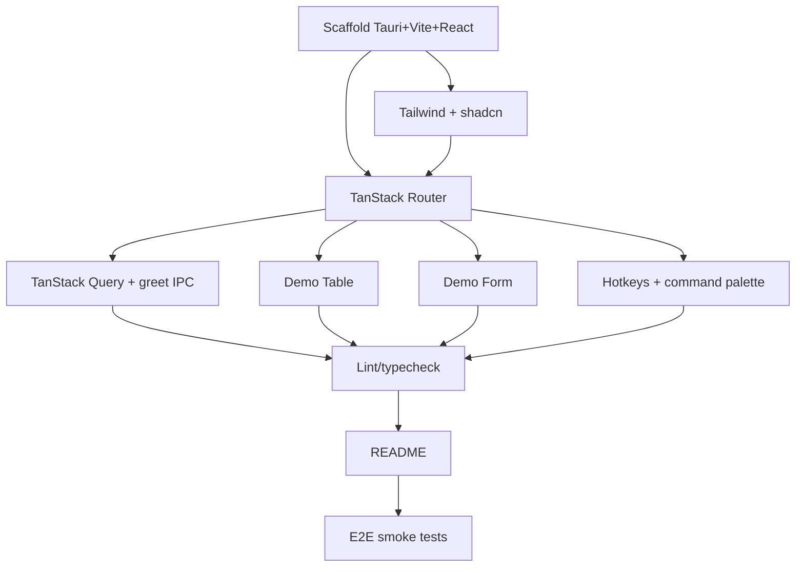

# Plan: Bootstrap - Tauri + React + TanStack Scaffold

**Spec:** docs/features/20260618193518-bootstrap/spec.md
**Created:** 2026-06-18
**Estimated Effort:** ~0.5-1 day
**Status:** Draft

## 1. Overview

Create a runnable empty desktop app: Tauri 2 shell + Vite/React 19/TS frontend, wired
with TanStack Router/Query/Table/Form, react-hotkeys-hook keybindings, and shadcn/ui +
Tailwind v4. Each TanStack lib proven with a minimal demo. No product features.

## 2. Task Breakdown

| # | Task | Spec Ref | Files | Type | Estimate |
|---|------|----------|-------|------|----------|
| 1 | Scaffold Vite + React + TS + Tauri 2 (`npm create tauri-app`) | AC-001, AC-002 | `package.json`, `vite.config.ts`, `src-tauri/**`, `index.html`, `.nvmrc` | impl | 1h |
| 2 | Add Tailwind v4 + init shadcn/ui, add Button | AC-008 | `src/index.css`, `components.json`, `src/components/ui/button.tsx`, `tailwind`/postcss config | impl | 1h |
| 3 | Wire TanStack Router: root layout + `/` + `/settings` + 404 | AC-003 | `src/router.tsx`, `src/routes/**`, `src/main.tsx` | impl | 1h |
| 4 | Wire TanStack Query: `QueryClientProvider` + `greet` Tauri command + demo query | AC-004, AC-011 | `src-tauri/src/lib.rs`, `src/lib/tauri.ts`, `src/routes/index.tsx` | impl | 1.5h |
| 5 | Demo TanStack Table (placeholder request-history rows) | AC-005 | `src/components/demo-table.tsx` | impl | 0.5h |
| 6 | Demo TanStack Form (one validated field + submit) | AC-006 | `src/components/demo-form.tsx` | impl | 0.5h |
| 7 | Global keybinding (`Mod+K`) via TanStack Hotkeys `useHotkey` → command-palette placeholder | AC-007 | `src/components/command-palette.tsx`, `src/router.tsx` | impl | 0.5h |
| 8 | Lint + typecheck + scripts (`start` → `tauri dev`, `lint`, `typecheck`, `format`) | AC-010 | `package.json`, `eslint.config.js`, `tsconfig.json` | impl | 0.5h |
| 9 | README run instructions + prerequisites | AC-009, deps | `README.md` | impl | 0.5h |
| 10 | E2E smoke tests for TC-001..TC-004 | AC-002..007 | `tests/e2e/bootstrap.spec.ts` | test | 1h |

## 3. Execution Order

## 4. TDD Strategy

Scaffold work is mostly config, so strict RED-first is impractical for tasks 1-2.
Apply TDD where behavior exists (routing, query, hotkey).

### RED Phase
- Write `tests/e2e/bootstrap.spec.ts` cases for TC-001..TC-004 against expected selectors before wiring the corresponding component.

### GREEN Phase
- Implement each demo until its E2E case passes.

### REFACTOR Phase
- Extract shared layout, query client, and providers into `src/app/` once duplicated.

## 5. File Changes

### New Files
- `package.json`, `vite.config.ts`, `index.html`, `.nvmrc` — frontend tooling
- `src-tauri/` (Cargo.toml, tauri.conf.json, `src/lib.rs`, `src/main.rs`) — desktop shell
- `src/main.tsx`, `src/router.tsx`, `src/routes/{__root,index,settings,not-found}.tsx` — app entry + routing
- `src/lib/tauri.ts` — typed `invoke` wrappers
- `src/components/{demo-table,demo-form,command-palette}.tsx`, `src/components/ui/button.tsx` — demos + shadcn
- `src/index.css`, `components.json` — styling + shadcn config
- `eslint.config.js`, `tsconfig.json` — lint/types
- `tests/e2e/bootstrap.spec.ts` — smoke tests
- `README.md` — run instructions

### Modified Files
- `CLAUDE.md` — note stack decisions (optional)

## 6. Dependencies

### Must Complete First
- Task 1 (scaffold) blocks everything.

### Can Parallelize
- Tasks 5 (Table), 6 (Form), 7 (Hotkeys) are independent once Router (T3) exists.

## 7. Risks and Mitigations

| Risk | Impact | Mitigation |
|------|--------|------------|
| Tailwind v4 + shadcn config churn (v4 dropped `tailwind.config`) | Setup friction | Follow current shadcn "Tailwind v4 + Vite" guide via context7 |
| TanStack Router file-based vs code-based choice | Rework | Default to code-based routes for fewer build plugins; revisit later |
| TanStack Hotkeys is alpha | API churn / breaking changes | Pin exact version; isolate behind `command-palette.tsx`; revisit on stable release |
| Tauri OS prerequisites missing on dev machine | `tauri dev` fails | Document prerequisites in README; verify before T2 |
| E2E driving a Tauri window (WebDriver) is heavier than browser tests | Flaky/slow CI | Start with component/route tests in Vitest+RTL; add tauri-driver E2E later if needed |

## 8. Acceptance Verification

| AC ID | Criterion | Test(s) | Status |
|-------|-----------|---------|--------|
| AC-001 | Clean install | manual `npm install` | Pending |
| AC-002 | Dev window launches | TC-001 | Pending |
| AC-003 | Routing + nav | TC-002 | Pending |
| AC-004 | Query app-wide + demo resolves | TC-003 | Pending |
| AC-005 | Demo table renders | bootstrap.spec "demo table" | Pending |
| AC-006 | Demo form renders | bootstrap.spec "demo form" | Pending |
| AC-007 | Global hotkey | TC-004 | Pending |
| AC-008 | shadcn Button styled | TC-001 | Pending |
| AC-009 | Build succeeds | manual `npm run tauri build` | Pending |
| AC-010 | Lint + typecheck pass | manual | Pending |
| AC-011 | `greet` IPC callable | TC-003 | Pending |
