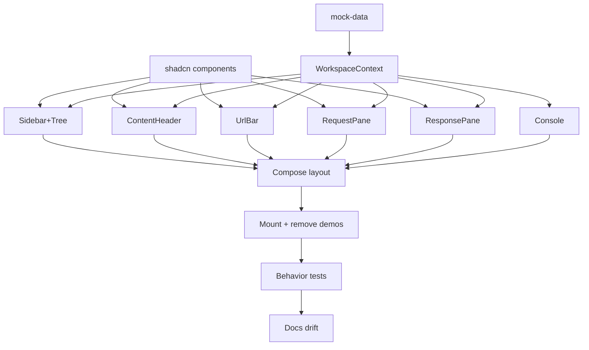

# Plan: Layout - MVP Workspace Shell

**Spec:** docs/features/20260618223203-layout/spec.md
**Created:** 2026-06-18
**Estimated Effort:** ~1-1.5 days
**Status:** Draft

## 1. Overview

Build the workspace shell with mock data and UI-local state only. Approach B:
context-driven compound components - one `WorkspaceProvider` owns all UI state; panels
read it via a `useWorkspace()` hook (no prop drilling). Replace the bootstrap home page;
remove demos, top nav, and command palette. Resizable splits via shadcn `resizable`.

## 2. Task Breakdown

| # | Task | Spec Ref | Files | Type | Estimate |
|---|------|----------|-------|------|----------|
| 1 | Add shadcn components: resizable, tabs, input, select, scroll-area, badge | deps, AC-013 | `src/components/ui/*`, `package.json` | impl | 0.5h |
| 2 | Mock data module: ADT tree + auth union + console lines, seeded to approved layout | AC-003, data model | `src/components/workspace/mock-data.ts` | impl | 1h |
| 3 | WorkspaceContext + provider + `useWorkspace` hook (state + actions, immutable updates) | AC-014, behavior notes | `src/components/workspace/workspace-context.tsx` | impl | 1.5h |
| 4 | SidebarTree + recursive TreeRow (folders expand/collapse, request leaf badge, selection) | AC-003, AC-004, AC-005, AC-006 | `src/components/workspace/{sidebar,sidebar-tree,tree-row}.tsx` | impl | 1.5h |
| 5 | ContentHeader (open-request tabs + close + `+`) | AC-007 | `src/components/workspace/content-header.tsx` | impl | 1h |
| 6 | UrlBar (method select + url input + inert Send) | AC-008 | `src/components/workspace/url-bar.tsx` | impl | 0.5h |
| 7 | RequestPane (Params/Headers/Auth/Scripts tabs; auth union switch) | AC-009, AC-011 | `src/components/workspace/request-pane.tsx` | impl | 1h |
| 8 | ResponsePane (Response/Headers tabs + status readout) | AC-010 | `src/components/workspace/response-pane.tsx` | impl | 0.5h |
| 9 | Console strip (mock log lines) | AC-012 | `src/components/workspace/console.tsx` | impl | 0.5h |
| 10 | Compose Content + Main + WorkspaceLayout (resizable groups) | AC-002, AC-013 | `src/components/workspace/{content,main,workspace-layout}.tsx` | impl | 1h |
| 11 | Mount at home route; remove demos, top nav, command palette | AC-001, AC-015 | `src/routes/{index,__root}.tsx`, delete `demo-*.tsx`, `command-palette.tsx` | impl | 0.5h |
| 12 | Behavior tests (Vitest + RTL) per TC-002..TC-005 + auth variants | AC-016, TC-002..005 | `src/components/workspace/__tests__/*.test.tsx` | test | 2h |
| 13 | Docs drift check: README repo-layout + commands; CLAUDE.md if convention added | - | `README.md` | impl | 0.5h |

## 3. Execution Order

T2 (mock-data) and T3 (context) are the spine - they unblock every panel. Panels
(T4-T9) parallelize once the context exists.

## 4. TDD Strategy

Per CLAUDE.md TDD: red-green-refactor on behavior. Panels have real interaction
(toggle, select, tab-switch) so they get failing tests first. Pure-presentational bits
(Console, inert Send) get a presence test only.

### RED Phase
- For each behavioral panel, write the failing test before the component:
  - TreeRow: expand reveals children / collapse hides; request leaf shows method badge.
  - Sidebar selection: request leaf click highlights + opens tab; folder click selects, no tab.
  - ContentHeader: tab click focuses; `x` removes; closing active moves active or nulls.
  - RequestPane: active sub-tab swaps panel; auth bearer renders token field (one per variant).
  - ResponsePane: Response/Headers tab swap; status readout present.
  - UrlBar: renders active request method + url (presence).
- Tests render a component wrapped in `WorkspaceProvider` seeded with a small mock tree.

### GREEN Phase
- Implement each panel until its test passes; wire actions through `useWorkspace()`.

### REFACTOR Phase
- Extract shared bits (e.g. method-badge, key-value table) once duplicated across panels.
- Tighten the context API surface; keep state immutable.

## 5. File Changes

### New Files (all under `src/components/workspace/`)
- `mock-data.ts` - ADT tree, auth union, console lines + seed data
- `workspace-context.tsx` - context, `WorkspaceProvider`, `useWorkspace`
- `sidebar.tsx`, `sidebar-tree.tsx`, `tree-row.tsx` - sidebar + recursive tree
- `content-header.tsx`, `url-bar.tsx` - content top rows
- `request-pane.tsx`, `response-pane.tsx` - the two panes
- `console.tsx` - console strip
- `content.tsx`, `main.tsx`, `workspace-layout.tsx` - composition + resizable shell
- `__tests__/*.test.tsx` - behavior tests
- `src/components/ui/{resizable,tabs,input,select,scroll-area,badge}.tsx` - shadcn (generated)

### Modified Files
- `src/routes/index.tsx` - render `WorkspaceLayout` instead of the demo page
- `src/routes/__root.tsx` - drop top nav + `CommandPalette`; layout owns full window
- `README.md` - update repo-layout sketch (new `components/workspace/`), drop demo refs

### Deleted Files
- `src/components/demo-table.tsx`, `src/components/demo-form.tsx`, `src/components/command-palette.tsx`
- their tests, if any

## 6. Dependencies

### Must Complete First
- Task 1 (shadcn primitives) blocks panels that use them.
- Tasks 2 + 3 (mock-data, context) block every panel.

### Can Parallelize
- Panels T4-T9 are independent once T1 + T3 land.

## 7. Risks and Mitigations

| Risk | Impact | Mitigation |
|------|--------|------------|
| `react-resizable-panels` nested groups (horizontal in vertical) layout quirks | Panes mis-size | Follow shadcn resizable docs via context7; test nesting early in T10 |
| Tree component / `TreeNode` type name clash | Confusion | Component named `TreeRow`; type stays `TreeNode` (per spec) |
| Removing command-palette leaves dangling `Mod+K` hotkey wiring | Build/lint error | Grep for hotkey + palette refs in `__root.tsx`/`router.tsx`; remove together in T11 |
| Deleting `/settings` link strands the route | Dead route | Keep route file; only remove the nav link (spec E-6) |
| Sub-tab state global vs per-request surprises later | Rework when editing lands | Documented MVP decision; revisit when real actions added |

## 8. Acceptance Verification

Test files live in `src/components/workspace/__tests__/` and `tests/e2e/bootstrap.spec.tsx`.
Verified by a fresh-context verifier subagent: all gates green, no hard blockers.

| AC ID | Criterion | Test(s) | Status |
|-------|-----------|---------|--------|
| AC-001 | Layout at home route | bootstrap.spec "render the workspace at the home route" | Pass |
| AC-002 | Full-window sidebar+content+console | bootstrap.spec home route; workspace-layout "render the tree and console together" | Pass |
| AC-003 | Tree with 3-deep nesting | sidebar-tree "nested three folders deep", "method badge" | Pass |
| AC-004 | Folder expand/collapse | sidebar-tree "reveal/hide a folder's children" | Pass |
| AC-005 | Request click selects + opens tab | sidebar-tree "select a request and open its tab" | Pass |
| AC-006 | Folder click selects, no tab | sidebar-tree "not open a request tab when a folder is clicked" | Pass |
| AC-007 | Content-header tabs + close + `+` | content-header: active, close, no-dup (E-3), reassign (E-4), null-on-last (E-4), New request | Pass |
| AC-008 | URL bar method+url+inert Send | url-bar "method and url", "empty state" (E-1) | Pass |
| AC-009 | Request sub-tabs render panels | request-pane "params by default and headers after click" | Pass |
| AC-010 | Response sub-tabs + status | response-pane "status and time", "headers after click" | Pass |
| AC-011 | Auth variants render | request-pane auth bearer/basic/none | Pass |
| AC-012 | Console strip | console "render each log line" | Pass |
| AC-013 | Resizable splits | manual/smoke (handles present; shadcn primitive owns drag) | Manual |
| AC-014 | Shared UI state, no prop drilling | architectural - panels render under provider only | Pass (arch) |
| AC-015 | Demos + nav + palette removed | bootstrap.spec "no bootstrap demo nav"; grep clean | Pass |
| AC-016 | lint + typecheck + test pass | typecheck 0 err, lint 0 err, 26/26 tests, build ok | Pass |

### Deviations from plan
- Initial launch state: per spec §4 the home route now seeds `initialActiveRequestId="r-token"` and expands all root folders (added after verifier flagged the gap).
- E-3 (no-duplicate tab) and E-4 (active-tab reassignment + null-on-last-close) tests were added post-verification; behavior was already correct but had been left unprotected.
- `react-resizable-panels` v4 uses `orientation` not `direction` (shadcn template gotcha; see docs/learnings.md).
