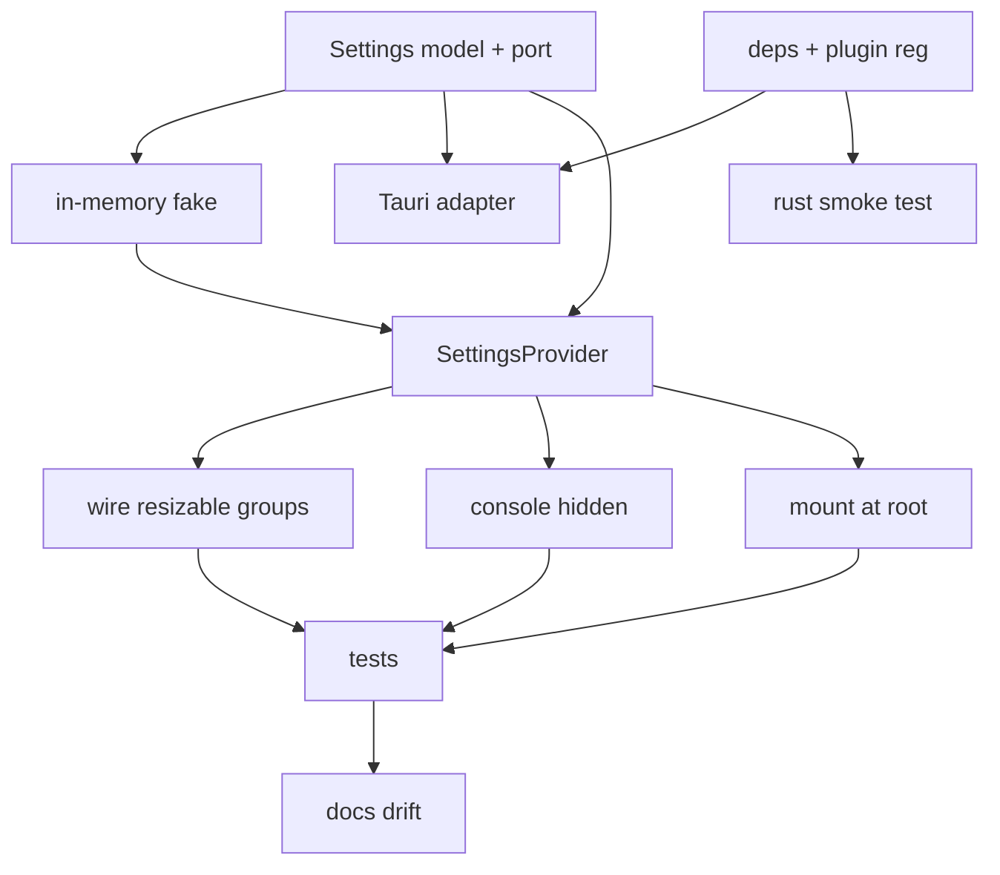

# Plan: User Settings - Per-Installation Persistence

**Spec:** docs/features/20260619115209-user-settings/spec.md
**Created:** 2026-06-19
**Estimated Effort:** ~0.5-1 day
**Status:** Implemented (all ACs verified)
**Coverage threshold:** none (no coverage gate in vitest.config.ts)

## 1. Overview

Add per-installation settings persistence behind a `SettingsStore` **port** (hexagonal:
one interface, two adapters). The app uses a Tauri-Store-plugin adapter writing JSON to
the OS app-config dir; tests/dev use an in-memory fake. A `SettingsProvider` loads on
launch and exposes `settings` + `saveLayout` with no prop drilling (mirrors
`WorkspaceProvider`). The three resizable groups gain stable panel `id`s, restore saved
sizes via `defaultLayout`, and persist on `onLayoutChanged`. The console body renders
only when `!consoleHidden`.

Approach: **port + adapter** chosen over calling the Tauri Store plugin directly from
components, because (a) Tauri can't run under jsdom, so a fake is mandatory for tests,
and (b) it isolates the alpha-ish plugin behind one swappable seam. Fallback-to-defaults
lives in the adapter (ADT-style: `load` never throws), not scattered try/catch.

## 2. Task Breakdown

| # | Task | Spec Ref | Files | Type | Est |
|---|------|----------|-------|------|-----|
| 1 | Add deps: npm `@tauri-apps/plugin-store`, Cargo `tauri-plugin-store`, register plugin in `lib.rs`, add `store:default` capability | deps, AC-001 | `package.json`, `src-tauri/Cargo.toml`, `src-tauri/src/lib.rs`, `src-tauri/capabilities/default.json` | impl | 0.5h |
| 2 | `Settings` model + `DEFAULT_SETTINGS` + `SettingsStore` port + per-field merge helper | data model, AC-005 | `src/lib/settings/settings.ts` | impl | 0.5h |
| 3 | In-memory fake store (`createInMemorySettingsStore`) | AC-006 | `src/lib/settings/in-memory-store.ts` | impl | 0.25h |
| 4 | Tauri-Store adapter (`createTauriSettingsStore`): load/save JSON via plugin; catch -> defaults/no-op when Tauri absent | AC-001, AC-004, AC-005, AC-007 | `src/lib/settings/tauri-store.ts` | impl | 1h |
| 5 | `SettingsProvider` + `useSettings`: async load on mount, expose `settings` + `saveLayout`; render children after load | AC-002, AC-006 | `src/lib/settings/settings-context.tsx` | impl | 1h |
| 6 | Wire 3 resizable groups: stable panel ids + `defaultLayout` from settings + `onLayoutChanged` -> `saveLayout`; group keys `workspace`/`main`/`content` | AC-002, E-5 | `src/components/workspace/{workspace-layout,main,content}.tsx` | impl | 1h |
| 7 | Console honors `consoleHidden`: `main.tsx` omits console panel+handle when hidden | AC-003, E-7 | `src/components/workspace/main.tsx` | impl | 0.25h |
| 8 | Mount `SettingsProvider` at app root above `WorkspaceProvider` | AC-001 | `src/routes/index.tsx` (or `app/providers.tsx`) | impl | 0.25h |
| 9 | Tests (Vitest+RTL): port round-trip, merge/corrupt, provider load, console-hidden render, layout-restore prop wiring | AC all, TC-001..005 | `src/lib/settings/__tests__/*.test.{ts,tsx}` | test | 2h |
| 10 | Rust test for plugin registration smoke (builder constructs) if practical; else N/A | AC-008 | `src-tauri/src/lib.rs` | test | 0.25h |
| 11 | Docs drift: README (new dep/plugin + settings-file note), learnings (resizable persistence gotchas) | - | `README.md`, `docs/learnings.md` | impl | 0.5h |

## 3. Execution Order



T2 (model + port) is the spine. T3/T4/T5 hang off it. UI wiring (T6/T7) needs the
provider. T1 (deps) only blocks the Tauri adapter + rust test, so it can run in parallel
with the pure-TS spine.

## 4. TDD Strategy

Red-green-refactor on observable behavior. The port + fake make every behavior testable
without Tauri.

### RED (failing tests first)
- **Port round-trip** (TC-005): save via `createInMemorySettingsStore`, reload, assert
  saved layout present. (AC-006, AC-002)
- **Merge/corrupt** (TC-004): `mergeSettings(DEFAULT_SETTINGS, partial)` keeps valid keys,
  fills missing from defaults; garbage/`null` -> defaults. (AC-005, E-2, E-3)
- **Provider load** (TC-003): mount `SettingsProvider` over a fake seeded empty -> children
  see `DEFAULT_SETTINGS`; seeded with a layout -> children see it. (AC-004)
- **Console hidden** (TC-002): render workspace under provider with `consoleHidden:true`
  -> no `region[name=Console]`; with `false` -> present. (AC-003)
- **Layout persist wiring** (AC-002): dragging is owned by the lib; assert the seam
  instead - groups receive `defaultLayout` from settings and call `saveLayout` on
  `onLayoutChanged`. Test by spying the store/`saveLayout` (side-effect contract) and by
  asserting `defaultLayout` is applied (behavior).

### GREEN
- Implement model, fake, adapter, provider, wiring until tests pass. Minimal.

### REFACTOR
- Extract `mergeSettings`; keep `load` total (never throws). Tighten the context surface.

## 5. File Changes

### New
- `src/lib/settings/settings.ts` - `Settings`, `PanelLayout`, `PanelGroupKey`, `SettingsStore`, `DEFAULT_SETTINGS`, `mergeSettings`
- `src/lib/settings/in-memory-store.ts` - `createInMemorySettingsStore(initial?)`
- `src/lib/settings/tauri-store.ts` - `createTauriSettingsStore()`
- `src/lib/settings/settings-context.tsx` - `SettingsProvider`, `useSettings`
- `src/lib/settings/__tests__/*.test.{ts,tsx}`

### Modified
- `src/components/workspace/workspace-layout.tsx` - panel ids `sidebar`/`content`; `defaultLayout` + `onLayoutChanged` for group `workspace`
- `src/components/workspace/main.tsx` - panel ids `content`/`console`; group `main`; conditionally render console on `consoleHidden`
- `src/components/workspace/content.tsx` - panel ids `request`/`response`; group `content`
- `src/routes/index.tsx` - wrap `WorkspaceProvider` in `SettingsProvider`
- `src-tauri/src/lib.rs` - register `tauri_plugin_store`
- `src-tauri/Cargo.toml`, `package.json`, `src-tauri/capabilities/default.json`
- `README.md`, `docs/learnings.md`

### Deleted
- none

## 6. Key Decisions (for ADR/Decision Log)

- **Port + two adapters** for settings persistence (vs direct plugin calls). Rationale:
  testability under jsdom + isolate the plugin behind one seam.
- **Tauri Store plugin** (vs custom Rust fs commands / localStorage). Rationale: official,
  debounced auto-save, least Rust boilerplate. (Confirmed with user.)
- **`load` is total** (returns defaults on any failure) - ADT-style over throwing; corrupt
  file and missing-Tauri collapse to the same safe path.
- **No console toggle UI** - `consoleHidden` mutated only by hand-editing JSON until a
  future command-palette feature. (Confirmed with user.)

## 7. Risks and Mitigations

| Risk | Impact | Mitigation |
|------|--------|------------|
| `defaultLayout` map shape vs current string-`%` `defaultSize` props interplay in react-resizable-panels v4 | Panels mis-size on restore | Verify against context7 docs; keep `defaultSize` as fallback when a group has no saved layout (E-5); test the wiring early in T6 |
| Tauri Store plugin throws under `npm run dev` (no native host) | Blank app in browser dev | Adapter catches: `load`->defaults, `save`->no-op+warn (AC-007, E-4) |
| Async load gates first paint | Flash / empty window | Provider renders only after load resolves; load is a fast local-file read; optional minimal placeholder |
| Panel `id` collisions across nested groups | Wrong layout restored | ids are per-group; group key namespaces them in `settings.layouts` |
| Plugin version drift vs `@tauri-apps/api` v2 | Build break | Pin to v2 line matching existing api dep; `cargo build` + `tsc` gate in verify |

## 8. Acceptance Verification

Status: **all ACs PASS** (verified by two fresh-context verifier subagents; loop closed).

| AC | Criterion | Test(s) / Evidence | Status |
|----|-----------|--------------------|--------|
| AC-001 | Persist JSON in app-config dir, survives restart | `tauri-store.ts` (`LazyStore("settings.json")` set+save) + `cargo build` (plugin registers); disk round-trip is manual-only (no Tauri host under jsdom) | Pass (code) |
| AC-002 | Resize persists + restores per group | `settings-context.test.tsx` "should round-trip a saved layout through the store to a fresh provider", "should persist via store.save if saveLayout is called"; group wiring in `{workspace-layout,main,content}.tsx` (`defaultLayout` + `onLayoutChanged`) | Pass |
| AC-003 | Console body iff `!consoleHidden` | `__tests__/main.test.tsx` "should render the console body if consoleHidden is false" / "should not render the console body if consoleHidden is true" | Pass |
| AC-004 | First run -> defaults, no error | `settings-context.test.tsx` "should expose DEFAULT_SETTINGS to children if the store is empty"; `in-memory-store.test.ts` empty-store | Pass |
| AC-005 | Corrupt/partial -> per-field merge | `settings.test.ts` (9 cases: passthrough, partial fill, nested layout, drop-unknown, null/undefined/string/number -> defaults, no-throw) | Pass |
| AC-006 | All access via port; tests use fake | `SettingsStore` port; every test uses `createInMemorySettingsStore` | Pass |
| AC-007 | Tauri absent -> defaults/no-op | `tauri-store.ts` `load` -> `mergeSettings(DEFAULT_SETTINGS, undefined)` on catch; `save` -> `console.warn` no-op on catch | Pass (code) |
| AC-008 | lint+typecheck+test+cargo test green | lint 0 err (5 accepted warnings), typecheck 0 err, 47/47 vitest, cargo test ok | Pass |

### Deviations from plan
- `mise exec --` is used to run node 24 (`.nvmrc` pins 24; `nvm` is shimmed to `mise` on this machine). Recorded in docs/learnings.md.
- AC-003 rendering test (`main.test.tsx`) was added after the first verifier pass flagged the RED phase had omitted it (it had tested the flag value but not the DOM omission).
- `saveLayout` was refactored post-verify from an impure reducer (side effect inside `setSettings` updater) to a pure value-set + side effect outside, reading `settings` from closure (deps `[settings, store]`).
- No Rust unit test added (plan task 10 was optional); plugin registration is covered by `cargo build`.
```
