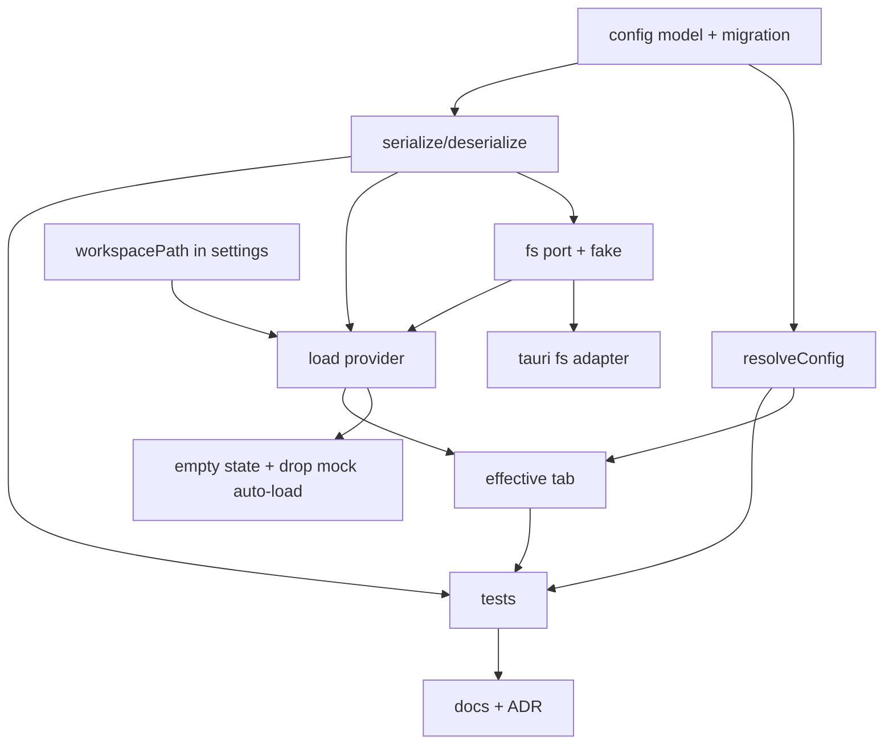

# Plan: Workspace Config - Persistence, Inheritance & Resolution

**Spec:** docs/features/20260619130809-workspace-config/spec.md
**Created:** 2026-06-19
**Estimated Effort:** ~1.5-2 days
**Status:** Implemented (all ACs verified)
**Coverage threshold:** none (no coverage gate in vitest.config.ts)

## 1. Overview

Add a real workspace config domain: a hierarchical `ConfigScope` on folders/requests, a
pure `resolveConfig` fold (root->request, child overrides parent, with provenance), a pure
directory-tree-mirror serialize/deserialize, a read-only `WorkspaceFs` port (Tauri `fs`
adapter + in-memory fake), and launch-time loading from a hand-edited `workspacePath` in
`settings.json`. A read-only Effective-config tab shows resolved values + provenance.

Approach is **hexagonal in 4 layers**, same shape as the settings feature. The domain
shape is **Composite** (folder=composite, request=leaf - already in the tree) + a
**resolution fold**; provenance is the one idea borrowed from the pricing archetype's
`ComponentBreakdown`. No heavy archetype machinery - merge rules are the real logic and
are simpler than a full calculator algebra. Pure layers (1-3) carry the risk and get the
bulk of the tests; they run under node/jsdom with zero Tauri.

## 2. Task Breakdown

| # | Task | Spec Ref | Files | Type | Est |
|---|------|----------|-------|------|-----|
| 1 | Config model: `ConfigScope`, `Auth` + `inherit` variant, move request flat fields under `config`; update `mock-data.ts` + the layout panels/tests that read `request.auth/headers/params/scripts` | data model, migration note | `src/components/workspace/mock-data.ts`, `request-pane.tsx`, `workspace-context.tsx` (+ affected `__tests__`) | impl | 2h |
| 2 | `resolveConfig(tree, requestId) -> EffectiveConfig` + `EffectiveConfig`/`ResolvedValue`/`Provenance` types; merge rules + defaults; pure, no IO | AC-001..006, merge table, E-1..E-5 | `src/lib/workspace/resolve.ts` | impl | 3h |
| 3 | Disk format: pure `serialize(tree) -> FileMap` + `deserialize(FileMap) -> Result<Tree>`; manifest/`folder.json`/`*.req.json`; slugging + collision disambiguation; stable ids | AC-007..009, E-6..E-10, format §2 | `src/lib/workspace/disk-format.ts` | impl | 4h |
| 4 | `WorkspaceFs` port (read-only) + in-memory fake | AC-010 | `src/lib/workspace/fs.ts`, `src/lib/workspace/in-memory-fs.ts` | impl | 1h |
| 5 | Tauri `fs` adapter: read managed files under root into a `FileMap`; deps + plugin reg + capability | AC-010, deps, infra | `src/lib/workspace/tauri-fs.ts`, `package.json`, `src-tauri/{Cargo.toml,src/lib.rs,capabilities/default.json}` | impl | 1.5h |
| 6 | Add `workspacePath?: string` to `Settings` model + `mergeSettings` | spec §8, AC-011/013 | `src/lib/settings/settings.ts` | impl | 0.5h |
| 7 | Workspace-load provider/wiring: on launch read `workspacePath` -> port -> deserialize -> tree (or empty state); expose loaded tree + active request's resolved config | AC-011,013, UI states | `src/components/workspace/workspace-context.tsx` (or a new `workspace-loader.tsx`), `src/routes/index.tsx` | impl | 2.5h |
| 8 | Empty state in sidebar when no/invalid workspace; remove mock auto-load from home route | AC-013, UI states | `src/components/workspace/sidebar.tsx`, `src/routes/index.tsx` | impl | 1h |
| 9 | Effective-config tab in request pane (read-only, resolved values + provenance) | AC-014, wireframe | `src/components/workspace/request-pane.tsx`, `pane-tabs.ts`, `workspace-context.tsx` (tab union) | impl | 2h |
| 10 | Tests (Vitest): resolution (TC-001..003,006), round-trip (TC-004), load-from-fake (TC-005), not-a-workspace/corrupt (TC-006), load-on-launch + empty (TC-007), effective view (TC-009) | AC all, TC all | `src/lib/workspace/__tests__/*`, `src/components/workspace/__tests__/*` | test | 4h |
| 11 | Docs drift: README (fs plugin, workspacePath, format sketch), learnings (fs scope gotchas), ADR (format + inheritance model) | - | `README.md`, `docs/learnings.md`, `docs/adr.md` | impl | 1h |

## 3. Execution Order

T1 (model + migration) unblocks everything. T2 (resolve) and T3 (disk format) are the two
pure spines - parallelizable, independently tested. T5 (Tauri adapter) is the only
non-jsdom-testable piece; verified by `cargo build` + manual.

## 4. TDD Strategy

Red-green-refactor on observable behavior. Pure layers dominate the test budget.

### RED (failing tests first), then GREEN minimal, then REFACTOR
- **resolve.ts** (the core domain): fixture trees with overrides at multiple depths.
  Assert effective values AND provenance. Cases mirror merge table + E-1..E-5:
  per-key var/header/param merge, deepest-wins, header case-insensitive, auth inherit
  chain + `{none}`/`{inherit}`, independent pre/post, timeout nearest, defaults+provenance.
- **disk-format.ts**: round-trip `serialize(deserialize(x)) ~= x`; deserialize a hand-built
  `FileMap` (manifest + folder.json + *.req.json) -> expected tree; not-a-workspace (no
  manifest) -> error Result; one malformed file -> that node skipped, rest load; slug
  collision -> deterministic disambiguation.
- **in-memory-fs + load provider**: seed fake FS with a workspace -> provider loads tree;
  no `workspacePath` -> empty state; invalid path -> empty state + error, no throw.
- **request-pane effective tab**: select nested request -> Effective tab lists resolved
  values with provenance labels (behavior via rendered DOM).
- **mergeSettings**: `workspacePath` honored / defaulted (extend existing settings tests).

Tauri `fs` adapter: no jsdom test (can't run Tauri); correctness by reading the adapter +
`cargo build` + manual launch. Documented as code-verified, like the settings adapter.

## 5. File Changes

### New (`src/lib/workspace/`)
- `resolve.ts` - `ConfigScope`, `EffectiveConfig`, `ResolvedValue`, `Provenance`, `resolveConfig`
- `disk-format.ts` - `FileMap`, `serialize`, `deserialize`, slug helpers, `Result` shape
- `fs.ts` - `WorkspaceFs` port type
- `in-memory-fs.ts` - `createInMemoryWorkspaceFs(files)`
- `tauri-fs.ts` - `createTauriWorkspaceFs()`
- `__tests__/*` - resolve, disk-format, in-memory-fs, load provider tests

### Modified
- `src/components/workspace/mock-data.ts` - `ConfigScope` on nodes; `Auth` gains `inherit`; flat request fields -> `config`; mock kept as a dev/demo fixture but NOT auto-loaded
- `src/components/workspace/request-pane.tsx` - read from `config`; add Effective tab
- `src/components/workspace/workspace-context.tsx` - tree comes from loaded workspace; tab union gains `effective`; expose active request's `EffectiveConfig`
- `src/components/workspace/pane-tabs.ts` - (only if shared styling needs a tweak)
- `src/components/workspace/sidebar.tsx` - empty state
- `src/lib/settings/settings.ts` - `workspacePath?: string` + merge
- `src/routes/index.tsx` - mount workspace loader; drop hard-coded mock seeding
- `src-tauri/{Cargo.toml, src/lib.rs, capabilities/default.json}`, `package.json`
- `README.md`, `docs/learnings.md`, `docs/adr.md`

### Deleted
- none (mock-data retained as a fixture)

## 6. Key Decisions (-> ADR)

- **Directory-tree mirror** on-disk format (vs single JSON). Git-friendly/diffable, scales,
  matches the file-based ethos. Costly to reverse (it's the public file contract). ADR row.
- **Inheritance model: per-key merge for collections, nearest-wins for scalars/auth,
  `undefined`/`inherit` = inherit, with provenance.** This is the core semantic contract;
  contested alternatives existed (whole-object override vs field merge for auth). ADR row.
- **Load-only this feature; save deferred** to a command-palette feature; `workspacePath`
  in `settings.json` is the (hand-edited) selection mechanism. (Confirmed with user.)
- **Plaintext secrets** inline. (Confirmed with user; documented risk.)
- Provenance borrowed from pricing `ComponentBreakdown`; full archetype machinery rejected
  as overkill. (Decision-log note, not necessarily ADR.)

## 7. Risks and Mitigations

| Risk | Impact | Mitigation |
|------|--------|------------|
| Tauri v2 `fs` scope won't allow arbitrary user `workspacePath` | Can't read workspace | Research v2 scope config via context7 before T5; if needed use a broad read scope; verify with `cargo build` + manual read early |
| Model migration (flat request fields -> `config`) breaks layout tests | Red suite | Do T1 as its own red-green pass; update the 5-ish panels/tests in lockstep; keep `mock-data` shape changes minimal |
| Resolution merge-rule ambiguity (auth field-merge vs whole-object) | Wrong effective config | Spec pins it: auth = nearest whole-object; encode + test explicitly (TC-002) |
| Slug collisions / non-roundtrip ids | Save (future) corrupts tree | Deterministic slug + suffix disambiguation; round-trip test asserts id stability (AC-007) |
| Effective tab depends on resolved config that needs the full tree | Coupling | `resolveConfig` is pure (tree + id in); provider computes it for the active request and passes down |
| Scope creep toward editing/save | Overrun | Save/picker explicitly out (spec §10); serialize stays pure + unwired |

## 8. Acceptance Verification

Verified by two fresh-context verifier subagents (loop closed; final verdict PASS). Gates:
85 vitest tests, typecheck 0 err, lint 0 err (5 accepted warnings), cargo build + test ok.

| AC | Test(s) | Status |
|----|---------|--------|
| AC-001..006 (resolution + provenance) | `resolve.test.ts` (19 cases) | Pass |
| AC-007 (round-trip + stable ids) | `disk-format.test.ts` round-trip group | Pass |
| AC-008 (deserialize hand-built layout) | `disk-format.test.ts` "build a tree from a hand-built workspace file map" | Pass |
| AC-009 (not-a-workspace / corrupt / partial) | `disk-format.test.ts` (no-manifest, skip malformed) + `workspace-loader.test.tsx` partial-load | Pass |
| AC-010 (port + fake) | all suites use `createInMemoryWorkspaceFs` | Pass |
| AC-011/013 (load on launch / empty) | `workspace-loader.test.tsx` (5 cases) | Pass |
| AC-012 (round-trip, no write) | `disk-format.test.ts` identical-keys-on-reload | Pass |
| AC-014 (effective tab) | `effective-config.test.tsx` | Pass |
| AC-015 (gates) | verifier subagent | Pass |

### Deviations from plan
- Domain types extracted to `src/lib/workspace/model.ts` (re-exported by `mock-data.ts`) so the pure lib layer owns them; dependency points components -> lib.
- `mock-data.ts` retained as a dev fixture but is NOT auto-loaded (AC-013); the home route now renders `WorkspaceLoader` (empty state under jsdom / no Tauri).
- Partial-load surfacing (spec §5): the loader maps `deserialize().skipped` into console lines (`[workspace] skipped malformed file: <path>`); added a UI test after the first verifier flagged the gap.
- `DEFAULT_TIMEOUT_MS = 30000`; synthetic default provenance `{scopeId:"default", scopeName:"default"}`; slug-collision disambiguation by `-2`/`-3` suffix.
- fs capability scope = `$HOME/**` (workspace must live under home - documented in README + learnings).
- `bootstrap.spec.tsx` updated: home route now asserts the empty state (no auto-loaded mock tree).
- No Rust unit test added (optional in plan); plugin registration covered by `cargo build`.
